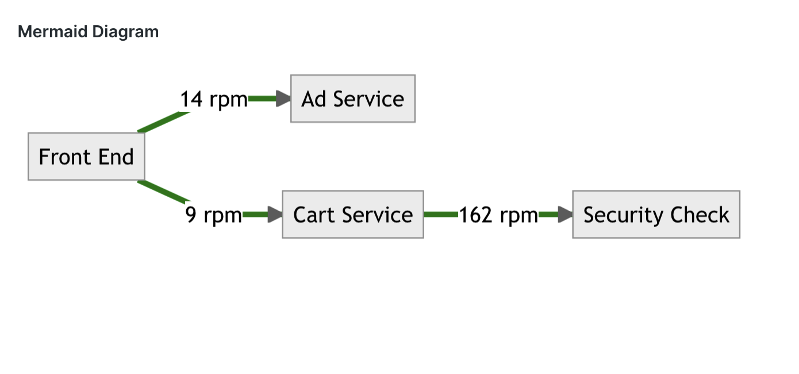
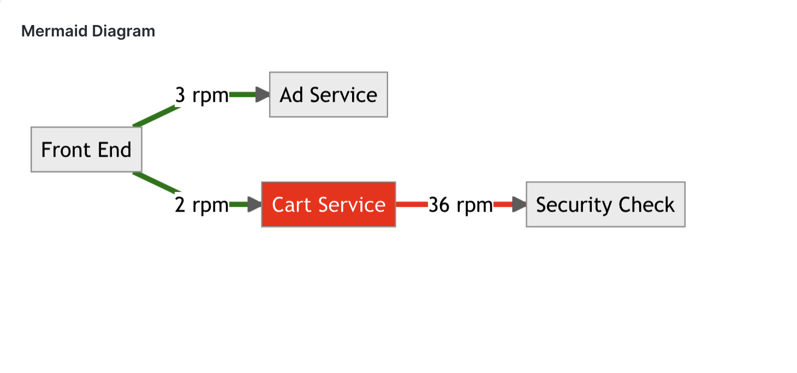

# Mermaid Custom Visualization

This visualization allows you to define a [Mermaid](https://mermaid.js.org) diagram and automatically hydrate it with the data from a NRQL query. It uses simple template interpolation to inject data.





## Installation

- Clone the repo
- Run `npm install`
- Install nr1 CLI and ensure the correct profile is selected `nr1 profiles:default`
- Generate a UUID `nr1 nerdpack:uuid -gf`
- Publish: `nr1 nerdpack:publish`
- Subscribe account: `nr1 subscription:set`


## Configuration options

The following options can be configured:

- *Definition*: The mermaid definition, remember to replace line breaks with `\n`
- *Account ID*: The account ID to query data from
- *Query*: The NRQL query that returns data to hydrate the diagram. One row result is expected.
- *Ignore time picker*: Check this box to ignore the time picker on dashboard.
- *Default since clause*: Specify a default since clause to use as default, when no time picker value has been chosen (dont inlcude this in your query)
- *Refresh interval*: Number of seconds between query refresh, default 300. Set to zero to disable refresh.


## Defining the mermaid diagram

The vizualisation uses version 8 of Mermaid. You can find the syntax on [Mermaid website](https://mermaid.js.org). Start by defining your mermaid diagram definition. e.g.

```
%%{init: {'theme':'neutral'}}%%
graph LR
A-->B
B-->C
```

Next add interpolation strings to be replaced by query values. These are in the format `[[[queryField|defaultValue]]]`

For example, if your query returns a field called `duration` then your deplacement string would be: ```[[[duration|0]]]```

```
%%{init: {'theme':'neutral'}}%%
graph LR
A-->|[[[duration|0]]]|B
B-->C
```

Finally replace all the line breaks with `\n` (unfortunately the custom viz configuration doesnt support text areas :( )
```
%%{init: {'theme':'neutral'}}%%\ngraph LR\nA-->|[[[duration|0]]]|B\nB-->C
```

### Styling
You can style the diagram using styling commands, you can even hydrate these with query values too. View the Mermaid documentation to see options.

Here is a toy example that hydrates the connections between boxes in a flow chart with numbers and conditionally sets the link color between C & D and the box C based on whether the seconds of time is mod 2:

Mermaid definition:
```
 %%{init: {'theme':'neutral'}}%%
flowchart LR
    A[Front End]
    B[Ad Service]
    C[Cart Service]
    D[Security Check]
    A-->|[[[AtoB|Unknown]]] rpm|B
    A-->|[[[BtoC|Unknown]]] rpm|C
    C-->|[[[CtoD|Unknown]]] rpm|D
    linkStyle default stroke-width:4px,stroke:green 
    linkStyle 2 stroke-width:4px,stroke:[[[linkColor|green]]]
    style C fill:[[[linkColor|green]]],color:#fff
```

NRQL Query:
```
SELECT 
latest(string(numeric(toDatetime(timestamp,'ss'))/2, precision:0)) as AtoB, 
latest(string(numeric(toDatetime(timestamp,'ss'))/3, precision:0)) as BtoC, 
latest(string(numeric(toDatetime(timestamp,'ss'))*6, precision:0)) as CtoD, 
latest(if(mod(numeric(toDatetime(timestamp,'ss')),2)=0,'red','green')) as linkColor 
from Transaction
```